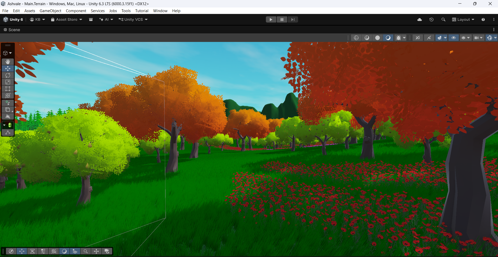

#  Ashvale — Environment Art
### Unity URP | Polytope Studio | Terrain Tools | Custom Shader Pipeline

---

##  About This Project

Environment art development log for **Ashvale** — a 3D stealth game built in Unity 6.3 LTS (URP).

This repo documents the full terrain creation pipeline: from raw Unity terrain to a styled, 
multi-zone forest environment with wind animation, post-processing, and custom shader setup.

This environment serves as the arena for Ashvale's stealth gameplay — 
enemy patrol routes, hiding spots, and the boss gate location are all 
designed into the terrain layout.

---

##  Tools & Tech Stack

| Tool | Purpose |
|---|---|
| Unity 6.3 LTS | Engine (URP pipeline) |
| Unity Terrain Tools | Height sculpting, texture painting, grass/tree placement |
| Polytope Studio — Lowpoly Environments | Tree, flower, rock, mushroom assets |
| Global Volume | Post-processing: Bloom, Color Grading, Tonemapping |
| Starter Assets Third Person Controller | Player locomotion for scene navigation |

---

##  Environment Design — Zone System

The terrain is built in 3 deliberate zones, matching stealth gameplay needs:

**Zone 1 — Ground Level (Player zone)**
Grass, flowers (red poppies, white flowers), small rocks, mushroom clusters.
Dense near patrol paths, open in exposed areas.

**Zone 2 — Mid Level (Stealth walls)**
Mixed tree species — autumn orange, red, lime green, pink blossom, dark pine.
Dense corridors create natural sightline blockers for stealth movement.

**Zone 3 — Background (Depth)**
Highland pine trees, distant mountain silhouette.
No gameplay purpose — exists for visual depth and world-feeling.

---

##  Technical Problems Solved

Problem 1 — LOD Group error when adding flowers as terrain detail
Problem: Adding flower prefabs via Paint Detail threw an 'LOD Group not supported' error
What I tried: Verified prefab import settings
Root cause: Unity's terrain detail painter doesn't support prefabs with LOD Groups
Solution: Added flowers through the Paint Trees tool instead, which supports LOD Group prefabs.

Problem 2 — Trees not moving with wind
Problem: Grass had wind movement but trees were static despite a Wind Zone in the scene
What I tried: Applied Unity's Nature/Soft Occlusion shader
Root cause: Polytope Studio uses its own custom wind shader system (PT_Vegetation_Foliage_Shader), separate from Unity's built-in wind system. Wind Zone is irrelevant for this pack.
Solution: Located the CUSTOM WIND section inside the Polytope shader, increased Wind Density from 0.01 to 0.5 and Wind Movement to 3. Trees animated correctly.

Problem 3 — Pink materials on grass and trees
Problem: Imported assets showed pink/magenta in URP project
What I tried: Re-importing assets
Root cause: Materials were using Built-in shader pipeline, incompatible with URP
Solution: Used Unity's built-in material converter (Edit → Rendering → Convert Materials) and manually reassigned URP-compatible shaders per prefab.

Problem 4 — Grass density error on terrain
Problem: Scattering grass threw errors; grass wouldn't appear
What I tried: Checked terrain painting workflow
Root cause: Detail density setting was too high for terrain resolution
Solution: Adjusted density value in terrain detail settings; grass scattered correctly afterward.
Manually Modified Grass Detail : 
 
Problem 5 — Directional Light only available in one scene
Problem: Directional light settings weren't applying across scenes
What I tried: Checked lighting configuration
Root cause: The light was scene-specific, not configured as shared/global
Solution: Fixed the light scope settings in the Inspector.

---

## 🔍 Key Technical Findings

> These are discoveries made through research and debugging — not found in standard tutorials.

- **Polytope Studio wind is shader-driven, not physics-driven.** Wind Zone GameObjects
  are irrelevant for this pack. All wind parameters live inside the custom shader's material settings.

- **Unity Terrain Paint Detail vs Paint Trees:** Detail painter only supports simple mesh/texture 
  details without LOD Groups. Any prefab with LOD Groups must use the Paint Trees tool.

- **URP Post-Processing uses Global Volume**, not the old Post Process Layer component 
  from Built-in pipeline. Overrides (Bloom, Color Grading, Tonemapping) are added as 
  Volume components, not camera effects.

- **Material color tinting in Polytope shader:** Different tree color variations (orange, red, 
  lime, pink) are achieved by duplicating the material and changing the Top Color / Ground Color 
  gradient parameters — no new mesh or texture needed.

---

## 📸 Screenshots

### Full Terrain Overview

### Ground Level — Red Poppy Field
screenshots/Screenshot%202026-07-06%20190054.png

### Pink Blossom Corridor

### Autumn Forest Section

### Rock & Detail Cluster

---

## 🚀 What's Next — Ashvale Full Game Repo

This environment is the foundation. The full Ashvale game repo will cover:

- ✅ Environment Art (this repo)
- 🔴 Enemy AI State Machine — Patrol → Alert → Chase (NavMesh + C#)
- 🔴 Stealth Detection — Vision cone, line of sight, noise system
- 🔴 Inventory System — ScriptableObject architecture
- 🔴 Boss Fight — Unique attack patterns, health stakes mechanic
- 🔴 Full game repo on completion

---

## 👤 Developer

**Krishna Borse** — Unity Game Developer  
[GitHub Profile](https://github.com/krishnaborseGamedev) | [Portfolio](#)
